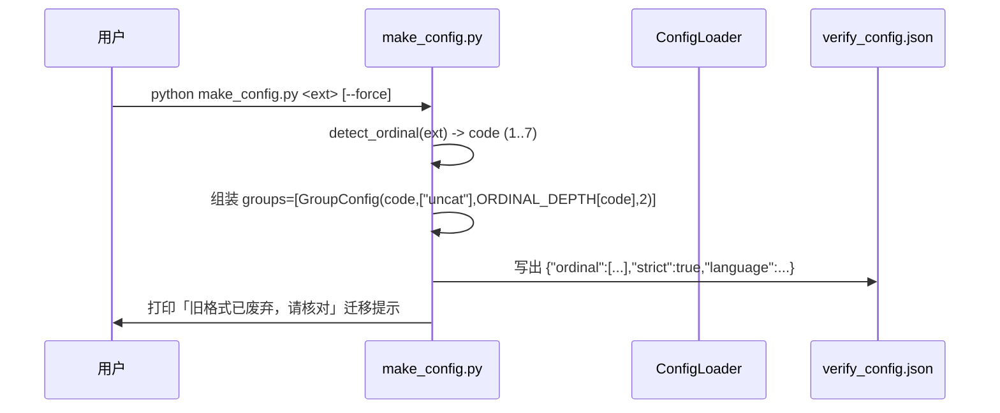

# verify_config.json 新配置 Schema 设计：ordinal 数组 + 分组模型

> 作者：software-architect-2 (Bob)
> 目标：把 `verify_config.json` 的 `ordinal`（单 int 选择器）+ `separate_types`（0/1 分离器）重构为 **`ordinal` 分组数组**，一次数据模型变更。
> 范围：**只做设计 + 有序任务分解，不写实现代码**。工程师据此实现。
> 存量策略（用户拍板）：旧 `{"ordinal": int}` 格式**废弃**，`from_dict` 直接抛 `ConfigError` 提示重跑 `make_config`；之后对 ~50 本存量书逐本重跑 `make_config` 重新生成配置。

---

## 0. TL;DR（给工程师）

- 新增 `GroupConfig` dataclass：`type:int / name:List[str] / depth:int / scope:int`。
- `BookConfig.ordinal` 由 `int` 变为 `List[GroupConfig]`。
- 删除 `separate_types`、`SEP_COMBINED` / `SEP_PER_TYPE` 常量、`BookConfig.depth` 派生属性、`group_prefix_len()`、提取侧 `_group_key(it, separate_types)`。
- 分组改为 **label → group 匹配**：条目 label 命中某 group 的 `name` 列表 → 归入该组；无命中 → 归入 `name` 含 `"uncat"` 的兜底组。**同组共享一个合并计数器，不同组计数器分开**（这正是取消 `separate_types` 的代价）。
- `scope`：旧字符串 `'book'/'chapter'/'section'` → 新 int `1/2/3`（= book/chapter/section）。`depth` 由「派生」变为「每个 group 显式字段」。
- `section_types` / `section_depths` / `language` / `strict` / `ignore` / `manual` **原样保留**（D 层小节校验正交、不动）。
- 旧 `{"ordinal": int}` → `from_dict` 抛 `ConfigError`（清晰迁移提示）；缺 `ordinal` 且文件存在 → `require_complete` 抛 `ConfigError`；文件缺失 → 仍 warn + 默认单组（向后兼容）。

---

## 1. 实现方案（Implementation Approach）

### 1.1 难点

1. **分组语义从「模式开关」变成「数据声明」**：旧 `separate_types=0/1` 控制「全共享计数器 vs 每类独立计数器」；新模型把分组信息编码进 `ordinal` 数组的每个元素（via `name`）。两侧（提取侧 `extract/b_layer.py` 与 MD 侧 `verify/layers/b_layer.py`）的 `_group_key` 逻辑都要替换为 `name → group` 匹配。
2. **多组可能异构**：同本书可声明多组，每组有独立 `type`(风格族 1–7)、`depth`(段数)、`scope`(计数边界)。解析层（MD 侧 `_md_gap_blocking`、`key_parse.keys_in_md`）过去按「单一 `ordinal` 决定深度」解析，现在要**逐组**解析。
3. **`extractor_family` 派生**：`extract_layer.py` 过去用 `ctx.config.ordinal`（单 int）选提取器分支（en/gm/roman/fraleigh vs 默认 CN）。新模型要从 `groups` 推导「本书结构族」`extractor_family()`，且 50 本存量书均为单一结构族（make_config 只产单组），故推导规则需保证回归一致。
4. **D 层小节默认值**：`d_layer.py` 用 `ORDINAL_SECTION_TYPES.get(cfg.ordinal)` 推导缺省小节层级。新模型无单 int，需 `cfg.primary_type()`（取主导风格组的 `type`）替代。

### 1.2 框架/库选择

- **无新依赖**：纯 Python 标准库（dataclasses / json / typing）。不引入新框架。
- 复用既有：`lib.regexlib`、`lib.config` 常量（`ORDINAL_*`、`ORDINAL_DEPTH`、`ORDINAL_STRUCTURE`、`ORDINAL_LANGUAGE_DEFAULT`、`ORDINAL_SECTION_TYPES`）、`verify/key_parse.py` 的 `_canon_label` / 各 `*_RE`。
- 架构模式：保持「ConfigLoader 单点读配置 → `BookConfig` 纯数据 → 各 Layer 经 `VerifyContext.config` 只读消费」的现状（已在 2026-08-06 refactor 落地），本次仅改数据模型与分组逻辑，不改「单点读、只读消费」原则。

---

## 2. 文件清单（File List）

| 文件 | 改动性质 | 关键改动 |
|---|---|---|
| `lib/config.py` | **核心重构** | 新增 `GroupConfig`；`BookConfig.ordinal: List[GroupConfig]`；`from_dict` 解析数组 + 拒旧格式；`require_complete` 逐组校验；新增 `primary_type()` / `extractor_family()` / `match_group()` / `uncat_group()`；删除 `separate_types` 字段、`SEP_COMBINED/SEP_PER_TYPE` 常量、`BookConfig.depth`、`group_prefix_len()`；`book_config_has_ordinal` 改「非空数组」检测 |
| `verify/make_config.py` | **输出格式** | 输出数组形式（单默认组 `{type, name:["uncat"], depth, scope:2}`）；打印迁移提示 |
| `extract/extract_items.py` | **签名/分组** | `extract_items(..., groups=...)` 替换 `ordinal=, separate_types=`；传入 `recover_missing_items(groups=...)` |
| `extract/b_layer.py` | **分组逻辑** | `_group_key(it, separate_types)` → `_group_key(it, groups)`（name→group 匹配）；删除 `from verify.layers.b_layer import SEP_*`；`recover_missing_items(groups=...)` |
| `verify/layers/b_layer.py` | **MD 侧分组** | `_md_gap_blocking` 逐组解析（label→group→该组 depth）+ 分组键 `(gi\|prefix)`；移除 `SEP_*` import/使用；`cfg.depth` → `group.depth`；`group_prefix_len()` → `group.prefix_len()` |
| `verify/key_parse.py` | **md 解析** | `keys_in_md(path, groups, chapter_roman=None)`：逐组按 `type` 选解析器，union 成 flat `entry_keys/all_keys`（保持 A 层不变） |
| `verify/layers/extract_layer.py` | **派发** | `cfg.extractor_family()` 选提取器；`extract_items(groups=cfg.ordinal)`；`keys_in_md(md, cfg.ordinal, ...)`；`_merged_category_first_missing` 网关改 `cfg.has_cn_three_level()` |
| `verify/layers/base.py` | **属性** | `ordinal` property 改为返回 `self.config.ordinal`（list），并更新 `extract_layer`/`p_layer`/`d_layer` 的 int 比较调用点改用 `cfg.extractor_family()` / `cfg.primary_type()` |
| `verify/layers/p_layer.py` | **适配** | `check_bare_items(lines, ordinal)` → `check_bare_items(lines, family)`（传 `cfg.extractor_family()`） |
| `verify/layers/d_layer.py` | **适配** | `cfg.ordinal in (GM,ROMAN)` → `cfg.primary_type() in (GM,ROMAN)`；`ORDINAL_SECTION_TYPES.get(cfg.ordinal)` → `ORDINAL_SECTION_TYPES.get(cfg.primary_type())` |
| `extract/scan_skeleton.py` | **适配/打印** | `loader.book.ordinal` → `loader.book.primary_type()` 喂 `_mode_for_ordinal(int)`；skeleton 头部 `ordinal=%s` 改为打印 groups 摘要 |
| `verify/verify_chapter.py` | **帮助文本** | 仅更新 usage/help 文本中关于 `ordinal`/`separate_types` 的描述（代码逻辑经 `require_complete` 已覆盖，无需改校验逻辑） |
| `verify/report.py` | **无改动** | 仅消费 `verify_one` 结果 dict，不触碰 `ordinal`，无需改 |
| `verify/tests/test_config_complete.py` | **测试** | 更新/新增：旧 `{"ordinal": int}` 抛 `ConfigError`；`require_complete` 逐组校验用例；`from_dict` 单组默认；make_config 新数组输出 |
| `references/layers/b.md`、`references/verification.md`、`references/layers/extract.md` | **文档同步（建议，P2）** | 同步分组模型说明（非阻塞，可后置） |

---

## 3. 数据结构与接口（Data Structures and Interfaces）

### 3.1 新 `GroupConfig`

```python
@dataclass
class GroupConfig:
    type: int                 # ORDINAL_* 风格码 1..7（风格族 + 默认 depth 来源）
    name: List[str]           # 标签类别列表，如 ["定理","定义"]；含 "uncat" 即兜底组
    depth: int                # 该组条目键的阿拉伯数字段数（如 章.节-号=3）
    scope: int                # 1=book / 2=chapter / 3=section（计数器重置边界）

    # --- 派生（非配置字段）---
    @property
    def structure(self) -> Optional[str]:
        return ORDINAL_STRUCTURE.get(self.type)   # None / 'en' / 'roman' / 'gm' / 'fraleigh'

    @property
    def language(self) -> str:
        return ORDINAL_LANGUAGE_DEFAULT.get(self.type, 'cn')

    def prefix_len(self) -> int:
        sp = {1: 0, 2: 1, 3: 2}.get(self.scope, 1)
        return min(sp, max(0, self.depth - 1))

    def is_uncat(self) -> bool:
        return 'uncat' in self.name
```

### 3.2 新 `BookConfig`（关键字段）

```python
@dataclass
class BookConfig:
    ordinal: List[GroupConfig] = field(default_factory=_default_groups)  # 单默认 uncat 组
    language: str = 'cn'                  # 顶层可选，默认 'cn'（保留）
    strict: bool = True                  # 保留
    ignore: List[str] = field(default_factory=list)        # 保留
    manual: Optional[str] = None          # 保留
    section_types: List[int] = field(default_factory=list) # 保留（D 层，正交）
    section_depths: List[int] = field(default_factory=list)

    # --- 新增派生助手（替代旧 depth / group_prefix_len / separate_types）---
    def primary_type(self) -> int: ...
    def extractor_family(self) -> str: ...        # 'cn'/'en'/'gm'/'roman'/'fraleigh'
    def match_group(self, canon_label: str) -> GroupConfig: ...
    def uncat_group(self) -> GroupConfig: ...
    def has_cn_three_level(self) -> bool: ...
```

> **`BookConfig.depth` 旧派生属性如何处置**：**删除**。`depth` 不再挂在 `BookConfig` 上，改为每个 `GroupConfig.depth` 显式存储。`b_layer` 中所有 `cfg.depth` 调用改为「先 `match_group(label)` 得到 group，再用 `group.depth`」。旧 `BookConfig.group_prefix_len()` 删除，改用 `group.prefix_len()`。`BookConfig.structure` / `BookConfig.family` 旧属性一并移除（`family` 无人调用；`structure` 仅服务于 `GroupConfig`，已上移）。

### 3.3 完整 JSON 示例

**多组（用户示例，含异构 type 3 + 4）：**
```json
{
  "ordinal": [
    {"type": 3, "name": ["定理","定义"], "depth": 3, "scope": 2},
    {"type": 3, "name": ["uncat"],      "depth": 3, "scope": 2},
    {"type": 4, "name": ["练习"],       "depth": 2, "scope": 2}
  ],
  "strict": true,
  "language": "cn",
  "section_types": [1, 2, 3],
  "section_depths": [1, 2, 3]
}
```

**单组（make_config 默认输出，等价于旧 `{"ordinal": 3}`）：**
```json
{
  "ordinal": [
    {"type": 3, "name": ["uncat"], "depth": 3, "scope": 2}
  ],
  "strict": true,
  "language": "cn"
}
```

### 3.4 Mermaid 类图

见 `docs/ordinal_groups_class.mermaid`。

---

## 4. 程序调用流（Program Call Flow）

### 4.1 `make_config` 生成新配置



### 4.2 `verify_one`（配置加载 → 提取 → MD 分组校验）

```mermaid
sequenceDiagram
    participant VC as verify_chapter
    participant LD as ConfigLoader
    participant EX as ExtractLayer
    participant EI as extract_items
    participant BL as BLayer(_md_gap_blocking)
    participant RP as report
    VC->>LD: ConfigLoader(ext,book); require_complete()
    LD->>LD: from_dict(data) -> BookConfig(ordinal:List[GroupConfig])
    LD-->>VC: loader.book (含 groups)
    VC->>EX: run(ctx)  (ctx.config = book)
    EX->>EX: family=cfg.extractor_family() 选提取器分支
    EX->>EI: extract_items(..., groups=cfg.ordinal)
    EI->>EI: recover_missing_items(groups=...)  # name→group 分组
    EX->>EX: keys_in_md(md, cfg.ordinal)  # 逐组解析 union
    EX-->>VC: ctx.items / entry_keys / all_keys
    VC->>BL: run(ctx)
    BL->>BL: 遍历 .md 粗体：match_group(label)->group.depth 解析
    BL->>BL: 按 (gi|prefix) 分组，组内首项/连续性 BLOCKING
    BL-->>VC: blocking/warnings
    VC->>RP: print_result(r)
```

> 关键差异点：**分组键从旧 `C.S`（或 `C.S:LABEL`）变为 `(gi|prefix)`**，其中 `gi` = 命中的 group 下标，`prefix` = 该组 `scope` 决定的前缀。同组共享计数器，跨组独立。

---

## 5. 各消费点设计细节

### 5.1 `BookConfig.from_dict`（lib/config.py）

```python
@classmethod
def from_dict(cls, data):
    data = data if isinstance(data, dict) else {}
    # --- ordinal：新数组格式；旧格式直接拒 ---
    raw = data.get('ordinal', None)
    if isinstance(raw, int):                      # 旧 {"ordinal": int} 废弃
        raise ConfigError(
            "[CONFIG] 旧版 verify_config.json（ordinal 为整数）已废弃。"
            "请用新格式：ordinal 为 group 数组，例如 "
            '{"ordinal":[{"type":3,"name":["uncat"],"depth":3,"scope":2}]}。'
            "请重跑 verify/make_config.py 重新生成配置。")
    if isinstance(raw, list) and raw:
        groups = [_parse_group(g) for g in raw]   # 逐组校验（见 5.2）
        _validate_groups(groups)                  # 至少一组 + 恰一个 uncat 组
    elif 'levels' in data:                        # 更老的 levels 也视为旧格式
        raise ConfigError("[CONFIG] 旧版 'levels' 字段已废弃，请重跑 make_config.py。")
    else:
        # 缺失 ordinal：产出默认单组（供「文件缺失→warn+默认」路径；
        # 若文件存在则 require_complete 会据 book_config_has_ordinal 抛错）
        groups = [_default_single_group()]
    # --- section_types/section_depths：原逻辑保留（正交）---
    ...
    # --- language/ignore/manual：原逻辑保留 ---
    return cls(ordinal=groups, language=..., strict=..., ignore=..., manual=...,
               section_types=st, section_depths=sd)

def _parse_group(g):
    # g: dict -> GroupConfig；逐字段校验
    t = int(g['type']);        assert t in ORDINAL_CODES
    depth = int(g['depth']);   assert depth >= 1
    scope = int(g['scope']);   assert scope in (1,2,3)
    names = [str(x) for x in g['name']]   # 建议在 from_dict 内 canonicalize
    return GroupConfig(type=t, name=names, depth=depth, scope=scope)
```

> `book_config_has_ordinal` 改为：`isinstance(data.get('ordinal'), list) and len(data['ordinal']) > 0`。

### 5.2 `require_complete` 逐组校验（lib/config.py）

替换原 `cfg.ordinal not in ORDINAL_CODES`（单 int 检查）为：

```
- 文件缺失 + allow_absent=True  -> WARN + 默认单组（保持向后兼容）
- 文件缺失 + allow_absent=False -> raise ConfigError
- 文件存在但 book_config_has_ordinal==False -> raise ConfigError("未声明 ordinal 数组")
- 逐组校验（每组 type∈ORDINAL_CODES、depth>=1、scope∈{1,2,3}、name 为 str 列表、
  至少一组、恰一个 uncat 组或有 uncat 兜底）-> 任一不合法 raise ConfigError
- section_types/section_depths 检查：原逻辑保留（仅当显式给出时）
```

### 5.3 b_layer 分组重设计（name→group 匹配）

**提取侧 `extract/b_layer.py`：**
- 删除 `from verify.layers.b_layer import SEP_COMBINED, SEP_PER_TYPE`。
- `_group_key(it, separate_types)` → `_group_key(it, groups)`：
  ```python
  def _group_key(it, groups):
      label = it.get('label', 'uncat')
      g = match_group_canon(label, groups)      # 调 BookConfig.match_group 的纯函数版
      gi = groups.index(g)
      sec = f"{parts[0]}.{parts[1].split('-')[0]}"   # 取 C.S
      # 该组前缀长度由 group.prefix_len() 决定（book=0/chapter=1/section=2）
      prefix = sec if g.prefix_len() >= 1 else ''
      return f"{gi}|{prefix}"
  ```
- `recover_missing_items(..., groups=...)`：原 `by_sec[_group_key(it, separate_types)]` 改为 `by_sec[_group_key(it, groups)]`。同组同键 → 合并计数器；跨组分开。

**MD 侧 `verify/layers/b_layer.py`：**
- 删除 `from lib.config import SEP_COMBINED, SEP_PER_TYPE` 及模块内 SEP 注释块。
- `_md_gap_blocking`：不再用 `cfg.depth` / `cfg.group_prefix_len()` / `cfg.separate_types`。
  改为：对每个粗体 span，`_parse_entry(inner, group)` 中先由 label 得 group（`match_group(canon_label)`），再用 `group.depth` 解析 numpath（gm/roman 组用 `key_parse` 的 roman/gm 解析器）。分组键 `gk = f"{gi}|{prefix_str}"`，`prefix_str` 长度 = `group.prefix_len()`。
- `gpl = cfg.group_prefix_len()`（两处：270、363）删除；改为在循环内按 `group.prefix_len()` 计算。
- 原 `if cfg.separate_types == SEP_PER_TYPE and label != 'uncat'` 分支删除（分组已由 `gi` 下标天然隔离）。uncat 条目归入 uncat 组，与旧 `SEP_PER_TYPE` 下 uncat 回退到 combined 键的语义一致。

### 5.4 `extract_items.py` 设计

- 签名：`extract_items(extract_dir, chapter, start, end, manual_overrides=None, groups=None)`（去掉 `ordinal=`、`separate_types=`）。
- `ExtractLayer` 选好基础提取器后，把 `groups=cfg.ordinal` 传给 `extract_items`；`extract_items` 再传给 `recover_missing_items(groups=...)`。
- 内部 `extract_items_two_level` / `extract_items_fr` 等分支选择器：保留（由 `ExtractLayer.extractor_family()` 在更上层决定走哪条路径，见 5.5），`extract_items` 自身只负责默认 CN 路径的分组。

### 5.5 `extract_layer.py` 与各层适配

- 提取器选择：`if ctx.config.ordinal == ORDINAL_EN` 等 → 改为 `fam = cfg.extractor_family()`：
  - `fam == 'en'` → `extract_items_en`（key 规范化同前）
  - `fam in ('gm','roman')` → `extract_items_gm`（roman chapter 前缀同前）
  - `fam == 'fraleigh'` → `extract_items_fr`
  - 否则 → 默认 `extract_items(..., groups=cfg.ordinal)`
- `keys_in_md(ctx.md_file, ordinal=ctx.config.ordinal)` → `keys_in_md(ctx.md_file, groups=cfg.ordinal, chapter_roman=...)`.
- `_merged_category_first_missing` 网关 `ctx.config.ordinal != ORDINAL_THREE_LEVEL` → `cfg.has_cn_three_level()`（任一 group.type==3）。
- `base.py` `ordinal` property 返回 `self.config.ordinal`（list）。所有 `ctx.config.ordinal == ORDINAL_*` / `in (...)` 的 int 比较点改为 `cfg.extractor_family()` / `cfg.primary_type()`。
- `p_layer.check_bare_items(lines, ctx.config.ordinal)` → `check_bare_items(lines, cfg.extractor_family())`（函数内部用 family 判断 bare 检测是否适用）。
- `d_layer`：
  - `if cfg.ordinal in (ORDINAL_GM, ORDINAL_ROMAN)` → `if cfg.primary_type() in (ORDINAL_GM, ORDINAL_ROMAN)`.
  - `ORDINAL_SECTION_TYPES.get(cfg.ordinal, [1])` → `ORDINAL_SECTION_TYPES.get(cfg.primary_type(), [1])`.

### 5.6 `make_config.py` 新输出

- `detect_ordinal(ext)` 仍返回单 int code（best-effort 不变）。
- 写出：
  ```python
  groups = [{"type": code, "name": ["uncat"],
             "depth": ORDINAL_DEPTH.get(code, 3), "scope": 2}]
  config = {"ordinal": groups, "strict": True,
            "language": ORDINAL_LANGUAGE_DEFAULT.get(code, 'cn')}
  ```
- 打印醒目迁移提示：「旧格式 `{"ordinal": int}` 已废弃；新格式 ordinal 为 group 数组；若由旧配置升级，请 `make_config.py --force` 重建」。

### 5.7 `scan_skeleton.py` / `verify_chapter.py` / `report.py`

- `scan_skeleton.py`：`ordinal = loader.book.ordinal`（line 190）改为 `ordinal = loader.book.primary_type()`（仍是 int，喂给既有 `_mode_for_ordinal(int)`）。skeleton 头部 `ordinal=%s` 打印改为打印 groups 摘要（如 `groups=3[3/3/4]` 表示 3 组 type3/depth3/type4）。
- `verify_chapter.py`：仅更新 usage/help 文本（line 379–382 区域），把 `ordinal / separate_types` 描述改为「ordinal 为 group 数组；分组由 name 编码；separate_types 已移除」。校验逻辑经 `require_complete` 已覆盖，无需改代码。
- `report.py`：**无需改动**（只消费结果 dict，不读 `ordinal`）。

---

## 6. 复用/共享知识（Shared Knowledge，给工程师）

- **分组键格式**：统一为 `f"{gi}|{prefix_str}"`（`gi`=命中 group 下标，`prefix_str`=该组 `scope` 决定的前缀，book 作用域为空串）。提取侧与 MD 侧必须一致，否则 A/B 比对错位。
- **label canonicalization**：`match_group` 的输入应是 **canonical label**（调用方先用 `verify.key_parse._canon_label` 规范化，如 `Definition→定义`）。`BookConfig.from_dict` 也应在存储前把每个 `name` 元素 canonicalize，避免 EN/CN 同义不匹配。`config.py` 为免循环 import，**不** import `key_parse`；canonical map 在 `config.py` 内用一份聚焦副本（与 `key_parse._LABEL_CANON` 保持同步——已在风险中标注）。
- **uncat 兜底**：每本书配置应恰有一个 `name` 含 `"uncat"` 的组；无命中 label 全归此组。`_validate_groups` 强制「恰一个 uncat 组或有 uncat 兜底」。
- **默认单组**：文件缺失/空 → `BookConfig` 默认 `[GroupConfig(3,["uncat"],3,2)]`，保证「文件缺失→warn+默认」向后兼容与 50 本存量书重跑前的临时可跑。
- **scope 映射**：`{1:0, 2:1, 3:2}`（book/chapter/section 的前缀长度），旧字符串映射 `{'book':0,'chapter':1,'section':2}` 删除。
- **D 层正交**：`section_types`/`section_depths`/`language`/`strict`/`ignore`/`manual` 全部原样保留，D 层小节校验逻辑不变。

---

## 7. 风险（Risks）

1. **双语 / 异构 type 同书（高风险）**：用户示例混合 `type 3`（CN 三级，裸键 `C.S-N`）与 `type 4`（EN 二级，标签键 `Definition 1.1`）。MD 侧解析器对两类键形态不同，A 层 `keys_in_md` 用 union 覆盖尚可，但 B 层连续性「同组共享计数器」在混合族下语义复杂（EN 组与 CN 组的 key 形态不互通）。**建议**：`make_config` 只产单组；混合族书（罕见）由人工写多组并自测。已在设计里允许但**不保证**自动正确。
2. **gm/roman 风格在数组下（中风险）**：`extract_items_gm` / roman 路径的机器键含罗马章号，`_md_gap_blocking` 的 numpath 解析需按 `group.structure` 选 roman/gm 解析器（复用 `key_parse` 的 `ENTRY_RE_ROMAN`/`GM_*`）。`keys_in_md` 同理需 `chapter_roman` 参数透传。**回归要求**：确认 Koopman(Kreyszig? 实为 GM) / 含 roman 书在重生配置下仍 PASS（见 QA）。
3. **循环 import**：`config.py` 不能 import `key_parse`（后者 import `config`）。`match_group` 的 canonicalization 在 `config.py` 内用聚焦副本解决；`from_dict` 存 canonical `name`。需人工确保两份 canon map 同步。
4. **`SEP_*` 删除的波及**：`SEP_COMBINED/SEP_PER_TYPE` 在 `config.py`、`verify/layers/b_layer.py`、`extract/b_layer.py` 三处定义/引用。删除时三处须同步，且 `references/refactor_separator_regexlib.md:124` 曾标注「严禁改动 SEP 常量」——本次变更需在该文档注明「本约束已被 2026-XX 分组重构取代」。
5. **`base.py` `ordinal` property 语义变更（int→list）**：所有 `ctx.config.ordinal` / `ctx.ordinal` 的 int 比较点（`extract_layer` 6 处、`p_layer`、`d_layer`）必须改为 `extractor_family()`/`primary_type()`，遗漏会导致 `int == tuple` 永远 False 或 AttributeError。已逐点列出。
6. **`require_complete` 旧测试契约翻转**：`test_config_complete.py` 现假设「非法 ordinal 被静默 clamp、不抛错」（KNOWN GAP）。新设计对旧 `{"ordinal": int}` **主动抛 `ConfigError`**，与旧测试预期相反——必须同步更新测试（见任务 T04）。
7. **`keys_in_md` 签名变更**：所有调用点（仅 `extract_layer.py`）需更新；若有其他脚本直接 import `keys_in_md`，一并改。

---

## 8. 有序任务分解（Task List，给工程师）

> 遵循系统角色约束的「≤5 主任务、按依赖排序、首任务为基础设施/核心模型」；每个主任务内含**文件级子清单**。实际实现可按子清单拆分 PR。

### T01 — 核心数据模型（`lib/config.py`）【P0，无前置依赖】
**文件**：`lib/config.py`
- 新增 `GroupConfig` dataclass（type/name/depth/scope + 派生 `structure`/`language`/`prefix_len`/`is_uncat`）。
- `BookConfig.ordinal: List[GroupConfig]`；删除 `separate_types` 字段、`BookConfig.depth`、`group_prefix_len()`、`BookConfig.structure`/`BookConfig.family`。
- 删除 `SEP_COMBINED` / `SEP_PER_TYPE` 常量。
- `from_dict`：解析数组 + 逐组校验；旧 `int`/`levels` 抛 `ConfigError`（迁移提示）；缺失→默认单组。
- 新增 `primary_type()` / `extractor_family()` / `match_group()` / `uncat_group()` / `has_cn_three_level()` / `_default_single_group()`。
- `book_config_has_ordinal` 改为「非空 list」检测。
- `require_complete`：逐组校验（type∈CODES、depth≥1、scope∈{1,2,3}、name 为 str 列表、至少一组、恰一个 uncat 组）；section 检查保留。
- 子步骤：①GroupConfig ②BookConfig 字段/删除 ③from_dict ④require_complete ⑤helpers ⑥常量清理。

### T02 — 双侧分组重构（提取侧 + MD 侧）【P0，依赖 T01】
**文件**：`extract/extract_items.py`、`extract/b_layer.py`、`verify/layers/b_layer.py`、`verify/key_parse.py`
- `extract_items.py`：`extract_items(..., groups=...)` 替换 `ordinal=, separate_types=`；传 `groups` 给 `recover_missing_items`。
- `extract/b_layer.py`：删除 `SEP_*` import；`_group_key(it, groups)`（name→group 匹配，`f"{gi}|{prefix}"`）；`recover_missing_items(groups=...)`。
- `verify/layers/b_layer.py`：删除 `SEP_*` import/使用；`_md_gap_blocking` 逐组解析（`match_group`→`group.depth`，gm/roman 用 roman/gm 解析器）；`cfg.depth`/`group_prefix_len()`/`cfg.separate_types` 全部替换为 `group.prefix_len()`；分组键 `f"{gi}|{prefix}"`。
- `verify/key_parse.py`：`keys_in_md(path, groups, chapter_roman=None)`：逐组按 `type` 选解析器 union 成 flat `entry_keys/all_keys`。

### T03 — 各层 ordinal→groups 适配 + make_config【P0，依赖 T01、T02】
**文件**：`verify/layers/extract_layer.py`、`verify/layers/base.py`、`verify/layers/p_layer.py`、`verify/layers/d_layer.py`、`extract/scan_skeleton.py`、`verify/verify_chapter.py`、`verify/make_config.py`
- `extract_layer.py`：`cfg.extractor_family()` 派发提取器；`extract_items(groups=cfg.ordinal)`；`keys_in_md(md, cfg.ordinal, ...)`；`_merged_category_first_missing` 网关改 `cfg.has_cn_three_level()`。
- `base.py`：`ordinal` property 返回 `self.config.ordinal`（list）；清理 int 比较点。
- `p_layer.py`：`check_bare_items(lines, family)`（传 `cfg.extractor_family()`）。
- `d_layer.py`：`cfg.primary_type()` 替代 `cfg.ordinal` 做 gm/roman 路由与 `ORDINAL_SECTION_TYPES` 查找。
- `scan_skeleton.py`：`loader.book.primary_type()` 喂 `_mode_for_ordinal`；头部打印 groups 摘要。
- `verify_chapter.py`：仅更新 help/usage 文本。
- `make_config.py`：输出数组形式单组 + 迁移提示。

### T04 — 测试更新【P1，依赖 T01–T03】
**文件**：`verify/tests/test_config_complete.py`
- 新增：`from_dict` 遇 `{"ordinal": int}` 抛 `ConfigError`；`require_complete` 逐组非法（type/depth/scope/name/无 uncat）抛 `ConfigError`；合法多组不抛。
- 更新：旧「非法 ordinal 静默 clamp」用例翻转（现应抛/或走默认单组）；`loader.book.ordinal`（现 list）断言改为 `loader.book.ordinal[0].type`；make_config 输出断言改为数组含 `type/name/depth/scope`。
- 保留：文件缺失→warn+默认（默认单组）仍 PASS。

### T05 — 三书回归验证【P0，依赖 T01–T04】
**文件**：（无新代码，回归执行）Kreyszig / Koopman / Apostol
- 对三书各重跑 `make_config.py --force` 重生 `verify_config.json`（新数组格式）。
- 各跑 `verify_chapter.py --all <ext> <book>` 应全 PASS（原回归基线 Kreyszig 11/11、Koopman 40/40、Apostol 28/28）。
- 额外构造 2–3 组合并/分离场景（如定理+定义合一组、练习独立组）做 B 层分组单测，验证「同组合并计数、跨组分开」。

---

## 9. QA 测试计划

### 9.1 `require_complete` 新用例（单测，T04）
| 用例 | 输入 | 期望 |
|---|---|---|
| 文件缺失 + allow_absent=True | 无文件 | warn + 默认单组，不抛 |
| 文件缺失 + allow_absent=False | 无文件 | `ConfigError` |
| 文件存在无 ordinal | `{"disable":[]}` | `ConfigError`（book_config_has_ordinal=False）|
| 旧 int 格式 | `{"ordinal": 3}` | `ConfigError`（from_dict 直接抛，迁移提示）|
| 旧 levels | `{"levels": 3}` | `ConfigError` |
| 合法单组 | `{"ordinal":[{"type":3,"name":["uncat"],"depth":3,"scope":2}]}` | 不抛 |
| 合法多组 | 用户示例（type3×2 + type4）| 不抛 |
| 组 type 非法 | `{"ordinal":[{"type":9,...}]}` | `ConfigError` |
| 组 depth<1 | `{"ordinal":[{"type":3,"name":["uncat"],"depth":0,"scope":2}]}` | `ConfigError` |
| 组 scope 非法 | `{"ordinal":[{"type":3,"name":["uncat"],"depth":3,"scope":4}]}` | `ConfigError` |
| 无 uncat 组 | `{"ordinal":[{"type":3,"name":["定理"],"depth":3,"scope":2}]}` | `ConfigError` |
| section 长度不等 | `{"ordinal":[...],"section_types":[1,2],"section_depths":[1]}` | `ConfigError`（保留）|

### 9.2 `from_dict` 拒旧格式（单测，T04）
- `from_dict({"ordinal": 3})` → `pytest.raises(ConfigError)` 且 message 含「已废弃」+「make_config」。
- `from_dict({"ordinal":[{"type":3,"name":["uncat"],"depth":3,"scope":2}]})` → `BookConfig`，`ordinal[0].type==3`。
- `from_dict({})` → 默认单组 `[GroupConfig(3,["uncat"],3,2)]`（文件缺失路径）。

### 9.3 `make_config` 新输出（集成，T03/T04）
- 在合成 CN 三级书 `_extract` 上跑 `make_config.py` → 退出 0，生成 `verify_config.json` 含 `"ordinal":[{"type":3,"name":["uncat"],"depth":3,"scope":2}]` + `"strict":true` + `"language":"cn"`；stdout 含迁移提示。
- 已存在配置（非 --force）→ 跳过退出 0。

### 9.4 b_layer 分组（2–3 组合并+分离，单测/集成，T05）
- 构造 .md：同一节内「定理 1.2-1 / 定义 1.2-1 / 定义 1.2-2」三类，配置两组：`G0{name:["定理","定义"],depth:3,scope:2}` + `G1{name:["练习"],depth:3,scope:2}` + `uncat`。断言：定理与定义共享 `0|1.2` 计数器（1.2-1 后接 1.2-2 视为连续），练习独立 `1|1.2`。
- 分离场景：配置 `G0{name:["定理"],...}` + `G1{name:["定义"],...}` + uncat → 两组计数器独立，缺号互不误报。
- 旧 `SEP_PER_TYPE` 行为回归：原 Kreyszig 风格（定义/定理/例共享一节计数器）在新模型下应写为「单组 name 含全部类别」→ 验证等价。

### 9.5 三书存量回归（集成，T05）
- Kreyszig / Koopman / Apostol：重跑 `make_config --force` → `verify_chapter.py --all` 全 PASS（基线 11/11、40/40、28/28 不退化）。
- 重点核对：Koopman（GM/roman 族）在 `extractor_family()`/`primary_type()` 推导下仍走 `extract_items_gm`；Apostol（EN 族）仍走 `extract_items_en`；Kreyszig（CN 三级）仍走默认路径且分组等价于旧 `SEP_PER_TYPE`。

### 9.6 验收门槛
- T04 单测全绿；T05 三书回归全 PASS；T04/T05 中任意「旧格式→抛错」「多组合并/分离」用例通过。

---

## 10. 仍不明确 / 假设（Anything Unclear）

- **混合结构族书的自动正确性**：用户示例含 `type 3 + type 4` 同书。设计允许但不保证自动正确（见风险 1）。假设：存量 50 书均为单结构族，make_config 只产单组；异构书由人工配置+自测。
- **`make_config` 检测精度**：仍 best-effort（原逻辑不变），`depth` 直接取 `ORDINAL_DEPTH[detected]`，不尝试逐组细分；多组精细配置由人工编辑。
- **`references/*.md` 文档同步**：列为 P2 建议，非阻塞；但 `refactor_separator_regexlib.md:124` 关于「严禁改动 SEP 常量」的约束须在该文档注明已被本次重构取代。
- **`ordinal_depth()` 旧函数**：grep 显示无外部调用，建议随 `BookConfig.depth` 删除一并移除（或保留为 `ordinal_depth(group)` 便捷函数）；本次默认移除。
