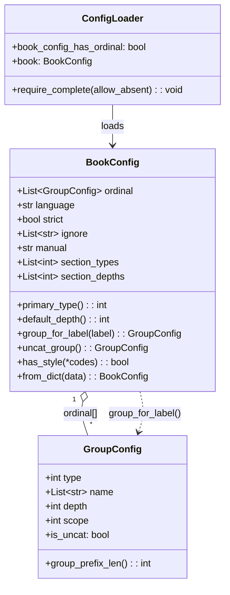
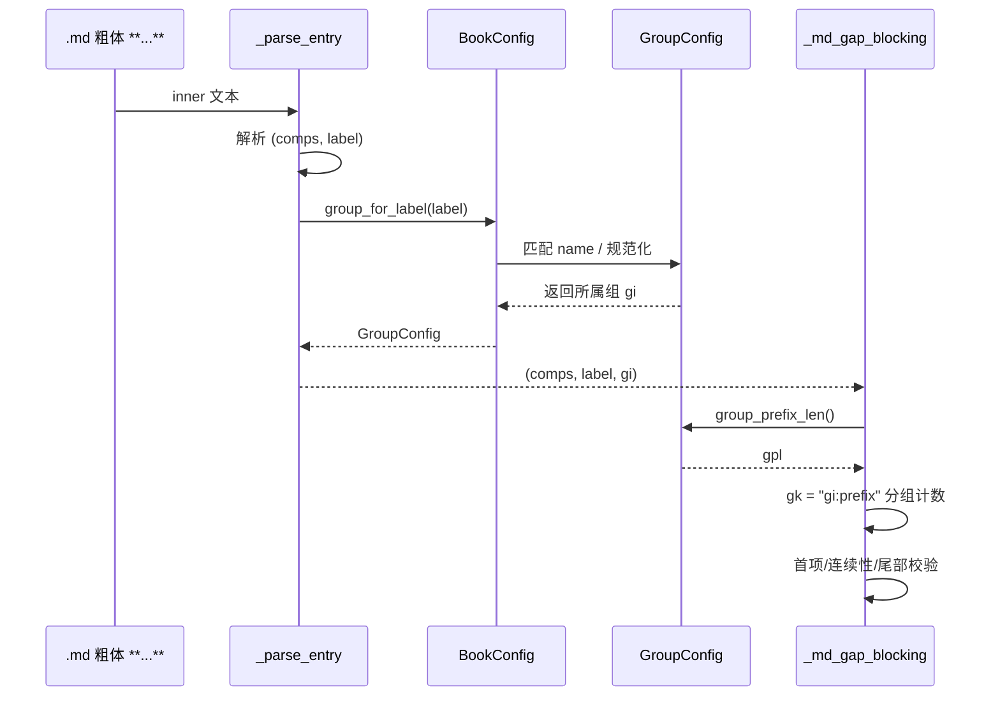
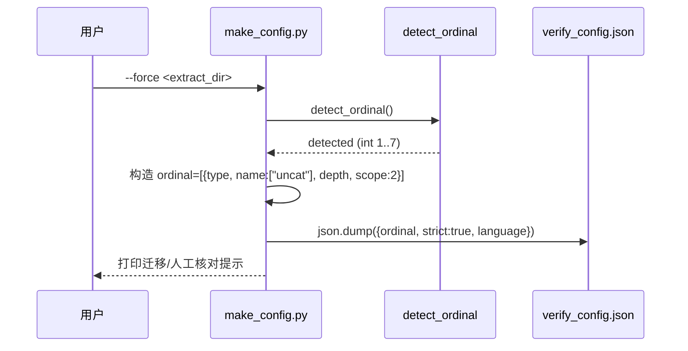

# verify_config.json 新 Schema 设计与重构分解（架构师交付）

> 范围：仅设计与分解，不写实现代码。所有代码片段为签名/伪代码级，供工程师落地。
> 触发：用户确认把 `ordinal` 由「单整数」改为「`GroupConfig` 数组」，取消 `separate_types`，
> `scope` 落到每组（int，1=book/2=chapter/3=section），`depth` 挂到每组。

---

## 0. 设计目标与 MVP 边界

**目标**：用一份 `ordinal` 数组显式编码「分组」——每个 group 由 `type`(风格码 1–7) /
`name`(标签类别列表) / `depth`(段数) / `scope`(重置边界) 定义，从而取代原
`separate_types` 的 `SEP_COMBINED`/`SEP_PER_TYPE` 二值开关。同一组共享一个合并计数器，
不同组计数器分开；无匹配 label 的条目归入 `uncat` 兜底组。

**MVP 边界（默认按此实现，越界即风险）**：
- 一本书内所有 group 应属**同一风格族**（要么全是 CN 三级，要么全是 EN 两级…）。
  跨风格混合（如 CN 三级 + GM/ROMAN）**不在 MVP 支持范围**，需在 `from_dict` 校验中报错或仅取主组。
- 允许**同一风格族内不同 `depth`/`scope`** 的分组（典型：定理/定义 depth=3 scope=2，
  练习 depth=2 scope=2）。这正是本重构的主场景。
- 存量书兼容策略：用户选「**强制重跑 make_config**」——旧 `{"ordinal": int}` 格式**废弃**，
  遇到直接 `ConfigError` 并提示重跑 `verify/make_config.py --force`。

---

## 1. 新 Schema 规格

### 1.1 `GroupConfig`（新增 dataclass，lib/config.py）

```python
SCOPE_BOOK, SCOPE_CHAPTER, SCOPE_SECTION = 1, 2, 3

@dataclass
class GroupConfig:
    type: int = ORDINAL_THREE_LEVEL          # ORDINAL_* 风格码 1..7
    name: List[str] = field(default_factory=lambda: ["uncat"])  # 标签类别
    depth: int = 3                           # 条目键阿拉伯数字段数
    scope: int = SCOPE_CHAPTER               # 1=book / 2=chapter / 3=section

    @property
    def is_uncat(self) -> bool:
        return "uncat" in self.name

    def group_prefix_len(self) -> int:
        # 与旧 BookConfig.group_prefix_len 语义一致，但按组计算
        sp = {SCOPE_BOOK: 0, SCOPE_CHAPTER: 1, SCOPE_SECTION: 2}.get(self.scope, 1)
        return min(sp, max(0, self.depth - 1))
```

### 1.2 `BookConfig`（改造，lib/config.py:153-187）

```python
@dataclass
class BookConfig:
    ordinal: List[GroupConfig] = field(default_factory=lambda: [GroupConfig()])  # 新：数组
    language: str = 'cn'                     # 顶层，保留（默认 'cn'）
    strict: bool = True
    ignore: List[str] = field(default_factory=list)
    manual: Optional[str] = None
    # D 层小节层级（正交，不动）
    section_types: List[int] = field(default_factory=list)
    section_depths: List[int] = field(default_factory=list)
    # —— 已删除字段 ——
    # separate_types: int   (移除，分组改由 ordinal 数组编码)
    # scope: str            (移除，scope 落到每组 GroupConfig.scope)
    # depth 派生属性        (移除，depth 改挂 GroupConfig.depth)
```

**删除的常量/属性**：
- `SEP_COMBINED` / `SEP_PER_TYPE`（lib/config.py:46-47）及 verify/layers/b_layer.py / extract/b_layer.py 中的同名导入与 `_group_key` 的 `SEP_PER_TYPE` 分支 → 全部移除/替换。
- `BookConfig.depth` 属性（:190-192）、`BookConfig.scope` 字段、`BookConfig.separate_types` 字段。
- `ordinal_depth()`（:103-105）标记 `@deprecated`，内部不再调用（扫描用 `ORDINAL_DEPTH` 直接查）。

### 1.3 完整 JSON 示例

**新格式（用户示例）**：
```json
{
  "ordinal": [
    {"type": 3, "name": ["定理","定义"], "depth": 3, "scope": 2},
    {"type": 3, "name": ["uncat"],      "depth": 3, "scope": 2},
    {"type": 4, "name": ["练习"],       "depth": 2, "scope": 2}
  ],
  "strict": true,
  "language": "cn",
  "section_types": [1,2,3],
  "section_depths": [1,2,3]
}
```

**旧→新对照**（存量书重跑 make_config 后）：
```json
// 旧（废弃）
{"ordinal": 3, "language": "cn"}
// 新（make_config 默认输出，单 uncat 组 = 合并计数器）
{"ordinal": [{"type": 3, "name": ["uncat"], "depth": 3, "scope": 2}],
 "strict": true, "language": "cn"}
```

### 1.4 `depth` 派生属性的处理

旧 `BookConfig.depth` 是 `ORDINAL_DEPTH[self.ordinal]` 的派生属性，被
`b_layer.py:277,367` 的 `_source_item_comps_label(it, cfg.depth)`、`_parse_entry(inner, cfg.depth)`
用作 numpath 正则的段数。新模型下 `depth` 是**每组独立的**，因此：
- 删除 `BookConfig.depth` 属性。
- 段数改为「先解析出 (comps, label)，再用 `group_for_label(label).depth` 决定该条目的段数」。
- `ORDINAL_DEPTH` 仅保留作为 `make_config` 的默认值来源（见 §6），不再作为 `cfg.depth` 入口。

### 1.5 关键辅助方法（BookConfig）

```python
@property
def primary_group(self) -> GroupConfig:
    # 第一个非 uncat 组；全是 uncat 则取 [0]
    for g in self.ordinal:
        if not g.is_uncat:
            return g
    return self.ordinal[0]

@property
def primary_type(self) -> int:
    return self.primary_group.type

@property
def default_depth(self) -> int:
    return max(g.depth for g in self.ordinal)

def uncat_group(self) -> GroupConfig:
    return next((g for g in self.ordinal if g.is_uncat), self.ordinal[0])

def has_style(self, *codes: int) -> bool:
    return any(g.type in codes for g in self.ordinal)

def group_for_label(self, label: str) -> GroupConfig:
    # 1) 把 label 规范化到英文 canon（定理<->Theorem 都可匹配）
    # 2) 把每个 group 的 name 列表也规范化到同一 canon 集合
    # 3) 命中则返回该 group；多个命中取首个（数组顺序优先）
    # 4) 无命中返回 uncat_group()
```

`group_for_label` 的 name 匹配要点（跨语言）：
- 用 `key_parse._canon_label` 把中文 label 与 group.name 都映射到英文 canon
  （如 `定理`↔`Theorem`、`练习`↔`Exercise`、`习题`↔`Exercise`），避免双语书漏配。
- `name` 可同时含中英文（如 `["练习","习题","Exercise"]`）。

---

## 2. `from_dict` 设计（lib/config.py:228-325）

```python
@classmethod
def from_dict(cls, data):
    if not isinstance(data, dict):
        data = {}

    # ---- ordinal：必须是数组（旧 int 格式直接拒绝 + 迁移提示）----
    raw = data.get('ordinal')
    if isinstance(raw, int):
        raise ConfigError(
            "[CONFIG] verify_config.json 仍使用旧版整型 ordinal，已废弃。"
            "请重新运行：python verify/make_config.py --force <book>/_extract"
            " 生成数组形式（见 references/verify_config_schema_v2_design.md）。")
    if isinstance(raw, str):
        raise ConfigError("[CONFIG] ordinal 必须是 GroupConfig 数组，字符串格式已废弃。")  # 旧 _LEGACY_ORDINAL_STR 不再接受
    if not isinstance(raw, list) or not raw:
        # 无 ordinal / 空数组：走默认（让 require_complete 兜底报错或给默认）
        groups = [GroupConfig()]
    else:
        groups = []
        for i, g in enumerate(raw):
            if not isinstance(g, dict):
                raise ConfigError(f"[CONFIG] ordinal[{i}] 必须是对象")
            t = int(g.get('type', ORDINAL_THREE_LEVEL))
            if t not in ORDINAL_CODES:
                raise ConfigError(f"[CONFIG] ordinal[{i}].type={t} 非法（应 1..7）")
            nm = g.get('name') or ["uncat"]
            if not isinstance(nm, list) or not all(isinstance(x, str) for x in nm):
                raise ConfigError(f"[CONFIG] ordinal[{i}].name 必须是字符串数组")
            dp = int(g.get('depth', ORDINAL_DEPTH.get(t, 3)))
            if dp < 1:
                raise ConfigError(f"[CONFIG] ordinal[{i}].depth={dp} 必须 >=1")
            sc = int(g.get('scope', SCOPE_CHAPTER))
            if sc not in (SCOPE_BOOK, SCOPE_CHAPTER, SCOPE_SECTION):
                raise ConfigError(f"[CONFIG] ordinal[{i}].scope={sc} 非法（应 1/2/3）")
            groups.append(GroupConfig(type=t, name=list(nm), depth=dp, scope=sc))

    # ---- R6：uncat 是显式决策，from_dict 不自动追加（见 §7 R6）----
    # 声明了哪些组就加载哪些组；没有 uncat 组 = 「本书没有 uncat 情况」，
    # 不再补默认 uncat、不再警告。uncat_group() 在无 uncat 时回退 ordinal[0]。

    # ---- section_types / section_depths（正交，原逻辑不动）----
    # 用 representative_ordinal = primary_type() 取 ORDINAL_SECTION_TYPES 默认
    ...

    # ---- language / strict / ignore / manual（原逻辑不动）----
    # 注意：移除 separate_types、levels 旧字段处理
    return cls(ordinal=groups, language=..., strict=..., ignore=...,
               manual=..., section_types=st, section_depths=sd)
```

要点：
- 旧 `{"ordinal": int}`、`"levels"`、字符串 ordinal **全部拒绝**（不再 warn+回退）。
- **R6**：至少一组即可；**无 uncat 组不追加、不警告**（uncat 是配置生成时的显式决策）。`uncat_group()` 在无 uncat 时回退 `ordinal[0]`。
- 不再处理 `separate_types` / `scope`(顶层) / `levels`。

---

## 3. `require_complete` / `ConfigLoader` 设计

**ConfigLoader._load_book_config（:380）**：`book_config_has_ordinal` 检测改为
```python
self.book_config_has_ordinal = isinstance(data.get('ordinal'), list) and len(data.get('ordinal')) > 0
```
→ 旧 `{"ordinal": int}` → `has_ordinal=False` → require_complete 报「未声明 ordinal（应为数组）」→ 自然强制迁移。

**require_complete（:383-453）**：把 `cfg.ordinal not in ORDINAL_CODES`（int 检查）换成逐组校验：
```python
if not self.book_config_has_ordinal:
    raise ConfigError("[CONFIG] ... 未声明 ordinal 数组 ...")
for g in cfg.ordinal:                       # 逐组校验
    if g.type not in ORDINAL_CODES: raise ConfigError(...)
    if g.depth < 1:             raise ConfigError(...)
    if g.scope not in (1,2,3):   raise ConfigError(...)
# R6：不再硬要求 uncat 组；无 uncat 时 uncat_group() 回退 ordinal[0]
# section_types / section_depths 检查（保留原逻辑不变）
```
文件缺失分支（`allow_absent`）仍 warn + 默认 `[GroupConfig()]`（即 `ordinal=[{type:3,...}]`），保持向后兼容。

---

## 4. b_layer 分组重设计

### 4.1 总体算法（name→group 匹配，取代 separate_types）

给定条目 label `L`：
1. `g = cfg.group_for_label(L)`（规范化匹配，无命中→uncat 组）。
2. 取 `g.group_prefix_len()` 作为该条目前缀长度 `gpl_e`。
3. 条目键 `(comps, num)`：前缀 = `comps[:gpl_e]`，组内序号 = `comps[gpl_e]`。
4. 组内计数键 `gk = f"{group_index}:{prefix_str}"`（group_index = cfg.ordinal.index(g)），
   保证不同组计数器绝不合并。

### 4.2 `extract/b_layer.py`

- `_group_key(it, separate_types)` → `_group_key(it, cfg)`：
  ```python
  def _group_key(it, cfg):
      label = it.get('label') or 'uncat'
      g = cfg.group_for_label(label)
      gi = cfg.ordinal.index(g)
      # 从 key 解析 (prefix_str, num)：three-level 'C.S-N' / two-level '标签C.S'
      prefix_str, _num = _key_prefix_num(it['key'], g.depth)
      return f"{gi}:{prefix_str}" if prefix_str else f"{gi}:file"
  ```
- `recover_missing_items(..., separate_types=0)` → `recover_missing_items(..., cfg)`：
  内部 `_group_key(it, separate_types)` 全部替换为 `_group_key(it, cfg)`；其余边界/内部/尾部逻辑不变。
- `_scan_and_recover` / `_try_label_rescan` 不动（仍按标签恢复）。

> 注意：`it['label']` 必须能正确反映 练习/习题/Exercise（见 §4.4 标签词扩展），否则 练习 会被归到 uncat 组而非 练习 组。

### 4.3 `verify/layers/b_layer.py`

- `_md_gap_blocking`（:342-455）：
  - 删除 `gpl = cfg.group_prefix_len()`（单值）。
  - 在 `_parse_entry(inner, cfg.depth)` 之后，按 (comps, label) 解析；再
    `g = cfg.group_for_label(label)`、`gpl = g.group_prefix_len()`、`gpl_e = min(gpl, len(comps)-1)`。
  - 构建 `gk = f"{gi}:{prefix_str}"`（gi = group index）。`file`/`file:label` 前缀改为 `f"{gi}:file"` / `f"{gi}:file:{label}"`。
  - 删除 `if cfg.separate_types == SEP_PER_TYPE ...` 分支（被 group 方案取代）。
- `_md_tail_warnings`（:256-326）：
  - `_source_item_comps_label(it, cfg.depth)` → `_source_item_comps_label(it, cfg)`：
    内部 `g = cfg.group_for_label(label)`，`_numpath_regexes(g.depth)` 解析；`src_max` 的 key 带上 group index，使尾部比对按组隔离。
- 删除模块顶 `from lib.config import SEP_COMBINED, SEP_PER_TYPE` 及 §329-336 的 separate_types 注释块。

### 4.4 `verify/layers/extract_layer.py`（:193-279）

- `if ctx.config.ordinal == ORDINAL_EN:` → `if cfg.primary_type() == ORDINAL_EN:`
- `elif ctx.config.ordinal in (ORDINAL_GM, ORDINAL_ROMAN):` → `elif cfg.primary_type() in (ORDINAL_GM, ORDINAL_ROMAN):`
- `extract_items(..., ordinal=ctx.config.ordinal, separate_types=cfg.separate_types)`
  → `extract_items(ctx.ext_dir, ctx.ch, ctx.start, ctx.end, manual_overrides=manual, cfg=cfg)`
- `keys_in_md(ctx.md_file, ordinal=ctx.config.ordinal)` → `keys_in_md(ctx.md_file, groups=cfg.ordinal)`（见 §5 key_parse）。
- `_merged_category_first_missing`：`if ctx.config.ordinal != ORDINAL_THREE_LEVEL:` → `if cfg.primary_type() != ORDINAL_THREE_LEVEL:`
- **标签词扩展（支持 练习 组路由）**：`extract_items.py` 与 `extract/b_layer.py` 的
  `label_re` / `_ENTRY_LABELS` / `_try_label_rescan` 增加 `练习|习题|Exercise|Exercise`（与现有 `例|Example` 同级），
  使 练习 条目在提取侧得到非 uncat 的 label，从而 `group_for_label('练习')` 能正确归入 练习 组。

---

## 5. `extract_items.py` 设计（:247）

签名改为接受 `cfg`：
```python
def extract_items(extract_dir, chapter, start_page, end_page,
                  manual_overrides=None, cfg=None):
    # cfg: BookConfig；取主组风格做抽取分发
    primary = cfg.primary_type() if cfg else ORDINAL_THREE_LEVEL
    if primary == ORDINAL_FRALEIGH:
        return extract_items_fr(...)
    if primary == ORDINAL_TWO_LEVEL:
        items, w, b = extract_items_two_level(...)
        ...  # 合并 manual
        return items, w, b
    # ---- 默认：CN 三级通吃抽取器（捕获所有 label，含 练习 two-level 扩展 pass）----
    ...
    items, warnings, blocking = recover_missing_items(
        extract_dir, chapter, start_page, end_page, items, label_re,
        TAIL_GAP_THRESHOLD, cfg)            # 末参由 separate_types 改为 cfg
    return items, warnings, blocking
```
- `ordinal` 分发改为 `cfg.primary_type()`（保留 FR/TWO_LEVEL 分支语义）。
- `recover_missing_items` 末参 `separate_types` → `cfg`。
- `__main__` 帮助与调用点同步：`--ordinal` 改为接受「组数组」或「单 type」便捷写法；CLI 旧 `--ordinal int` 保留为「单组快捷」（`[{type:int,name:["uncat"],depth:ORDINAL_DEPTH[int],scope:2}]`）。
- **抽取完整性补强（MVP 关键）**：CN 三级通吃抽取器需额外跑一个「two-level 练习」正则 pass
  （`(练习|习题|Exercise)\s*(\d+)[.\-](\d+)`），把 depth=2 的 练习 键也产出，否则 练习 组在
  A 层 truly_missing 会误报。属于 §10 风险点的落地补偿。

> `keys_in_md`（key_parse.py:198）扩展：新增 `groups` 形参；若传 `groups`，对每个 group 按其 `type` 走对应分支（`ENTRY_RE`/`ENTRY_RE_2`/`ENTRY_RE_EN_C`/`ENTRY_RE_ROMAN`/`GM_ENTRY_RE`/`FR_ENTRY_RE`），并集 `entries`/`allk`；`ordinal=` 旧形参保留为「单组快捷」（构造 `[GroupConfig(type=ordinal)]`）。`chapter_roman` 仅当 `cfg.has_style(ORDINAL_GM, ORDINAL_ROMAN)` 时透传。

---

## 6. `make_config.py` 新输出（verify/make_config.py:121-154）

`detect_ordinal` 不变（仍返回整型候选 `detected`）。写出改为数组：
```python
detected = detect_ordinal(extract_dir)
language = ORDINAL_LANGUAGE_DEFAULT.get(detected, 'cn')
config = {
    "ordinal": [{
        "type": detected,
        "name": ["uncat"],
        "depth": ORDINAL_DEPTH.get(detected, 3),
        "scope": 2,                       # chapter
    }],
    "strict": True,
    "language": language,
}
json.dump(config, f, ensure_ascii=False, indent=2)
# `scope`（计数重置边界，1=book / 2=chapter / 3=section）与 `depth`（编号段数）是**两个相互独立的轴**：
# scope 不随 depth 推算，而是由该书真实的 ordinal 标签形态按族（type）推导，与 type/depth 同族；
# make_config 的 best-effort 默认取 chapter(2)，仅当书确实按节重新计数时才升到 3。
# 醒目提示：若书含 定理/定义 需分组合并、练习 需独立计数，请手动把 ordinal 拆成多组；
# 旧版整型 ordinal 已废弃，旧书请 --force 重跑本脚本。
```
> ⚠️ **行为变更提示（重要）**：旧 `from_dict` 默认 `separate_types=SEP_PER_TYPE`（每类独立计数器）；
> 新默认输出是**单 uncat 组 = 合并计数器**。这是用户的明确选择，但会改变存量书缺号检测的计数粒度
> （见 §10 风险 R2）。3 本回归书需在此变更后重验。

---

## 7. `ordinal` 变 list 的其余取数/打印改动

| 文件 | 位置 | 改动 |
|------|------|------|
| `extract/scan_skeleton.py` | :190 `ordinal = loader.book.ordinal` | 改为 `cfg = loader.book; primary = cfg.primary_type(); mode = _mode_for_groups(cfg)`；`_mode_for_ordinal` 改为吃 `(primary_type, depth, lang)` |
| `verify/verify_chapter.py` | :379 帮助文本 | 把 `ordinal / language / scope / separate_types / strict / ignore / manual` 改为 `ordinal(数组) / language / strict / ignore / manual`；注明 scope/depth 已落到每组 |
| `verify/verify_chapter.py` | 其余 | 无 `loader.book.ordinal` 真实调用，仅 `_make_loader`→`require_complete`，不变 |
| `verify/report.py` | 全局 | 不读 config，无改动（仅 §6 B 层文本仍提及 scope，属历史描述，可顺手改） |
| `verify/layers/d_layer.py` | :202, :208 | `cfg.ordinal in (GM,ROMAN)` → `cfg.primary_type() in (GM,ROMAN)`；`ORDINAL_SECTION_TYPES.get(cfg.ordinal,...)` → `cfg.primary_type()`（D 层正交，取主组码定默认层级） |
| `verify/layers/base.py` | :205-207 `ordinal` 属性 | `return self.config.ordinal` → `return self.config.primary_type()`（供 p_layer 等 int 消费者） |
| `verify/layers/p_layer.py` | :360 `check_bare_items(lines, ctx.config.ordinal)` | 因 base.py `ordinal` 已返回 primary_type，无需改；或显式 `ctx.config.primary_type()` |

---

## 8. 文件改动清单 + 依赖顺序（给工程师的任务表）

| 任务 | 文件 | 依赖 | 优先级 |
|------|------|------|--------|
| **T1 配置核心** | `lib/config.py`：新增 `GroupConfig`；`BookConfig.ordinal:List[GroupConfig]`；删 `separate_types`/`scope`/`depth` 属性；加 `primary_type`/`group_for_label`/`uncat_group`/`default_depth`；改 `from_dict`；改 `require_complete` 逐组校验；`ConfigLoader._load_book_config` 的 `book_config_has_ordinal` 检测 | — | P0 |
| **T2 提取侧分组** | `extract/b_layer.py`（`_group_key`/`recover_missing_items` 改吃 `cfg`）；`extract/extract_items.py`（签名吃 `cfg`、分发用 `primary_type`、标签词扩展含 练习、two-level 练习 pass、末参 `cfg`） | T1 | P0 |
| **T3 MD 侧分组** | `verify/layers/b_layer.py`（`_md_gap_blocking`/`_md_tail_warnings` 按组 gpl、删 `separate_types` 分支、gk 带 group index）；`verify/key_parse.py`（`keys_in_md` 支持 `groups`） | T1 | P0 |
| **T4 全线 ordinal→list 接线** | `verify/layers/extract_layer.py`、`verify/layers/d_layer.py`、`verify/layers/base.py`、`verify/layers/p_layer.py`、`extract/scan_skeleton.py`、`verify/verify_chapter.py`(帮助文本) | T1,T2,T3 | P1 |
| **T5 make_config 新输出** | `verify/make_config.py`（数组输出 + 迁移提示） | T1 | P1 |
| **T6 测试 + 文档 + 回归** | `verify/tests/test_config_complete.py`、`verify/tests/test_d_section_levels.py` 改写（`cfg.ordinal`→`cfg.primary_type()`/数组断言、旧 int 拒绝用例）；`references/layers/b.md`、`references/verification.md`、`references/book_patterns.md`、`SKILL.md` 同步；Kreyszig/Koopman/Apostol 各 `--force` 重跑 make_config 后回归 verify | T1–T5 | P1 |

依赖图：`T1 → {T2,T3,T4,T5} → T6`；T2/T3/T4/T5 间相互独立，可并行。

---

## 9. QA 测试计划

**A. `require_complete` 新用例**（改 `test_config_complete.py`）
- (a) 文件缺失 + `allow_absent=True` → warn + 默认 `ordinal=[GroupConfig(type=3)]`，不抛。
- (b) 文件缺失 + `allow_absent=False` → 抛 `ConfigError`。
- (c) 文件存在但无 `ordinal` 键 → 抛（同现 (c)）。
- **(d) 文件存在但 `ordinal` 为整型（旧格式）→ 抛 `ConfigError`，消息含「make_config --force」**（新增，验证迁移拦截）。
- (e) `ordinal` 为合法数组 → 不抛；`loader.book.primary_type()` 正确。
- (f) 数组含非法 `type`/`depth<1`/`scope∉{1,2,3}` → 抛。
- (g) 数组无 uncat 组 → **不追加、不警告**（R6 最终决定：uncat 是显式决策；无 uncat 时 `uncat_group()` 回退 `ordinal[0]`）。
- (h) `section_types`/`section_depths` 不一致 → 仍抛（保留）。

**B. `from_dict` 拒旧格式**：`from_dict({"ordinal": 3})` 抛 `ConfigError`；`from_dict({"ordinal":[{"type":3,"name":["uncat"],"depth":3,"scope":2}]})` 正常。

**C. `make_config` 新输出**：对 CN 三级页内容跑 `make_config`，断言生成
`{"ordinal":[{"type":3,"name":["uncat"],"depth":3,"scope":2}],"strict":true,"language":"cn"}`；
旧整型 config + `--force` 重跑后变成数组；打印含「人工核对 / 废弃」提示。

**D. b_layer 分组（2–3 组合并+分离）**——纯单元：构造 `BookConfig` 含
`[{定理,定义}, {uncat}, {练习}]` 三组，喂入 `_md_gap_blocking` / `recover_missing_items`：
- 定理 与 定义 共享同一连续计数（不报假缺号）；
- 练习 独立计数（其编号与 定理 不混）；
- 未匹配 label 归入 uncat 组；
- 同组段内缺号仍硬 BLOCKING（strict 下）。

**E. 3 本存量书回归**（Kreyszig / Koopman / Apostol）：
- **策略（用户最终裁定）**：**不** blind 跑 `make_config --force` 再生默认 config——scope 必须按各书实际序标升序范围**手填**进数组（scope≠depth 是两独立轴）。3 本历史行为：Kreyszig 合并+节内升序(scope=3)、Koopman 每型独立(scope=2)+ignore、Apostol 合并+章内升序(scope=2)。
- 跑 `verify_chapter.py --all`；核对与**实际语料基线**一致或差异已记录：Kreyszig 历史 11/11（注：回归时若 .md 缺失则无法跑，须先恢复 .md）；Koopman 语料基线 37/40；Apostol 语料基线 8/52（书共 26 章×EN/CN=52 文件，非 28）。
- 重点关注：合并计数器默认下是否出现新的「缺号」误报（见风险 R2），若有则在 issue 登记并决定补显式分组。

---

## 10. 风险标注

- **R1 跨风格混合**：CN 三级 + GM/ROMAN 同书不在 MVP。建议 `from_dict` 校验「所有 group.type 属同一风格族」否则 `ConfigError`（或仅取 primary_type 并 warn）。双语书（同族 CN+EN 标签）OK，靠 `group_for_label` 规范化解决。
- **R2 默认行为变更（合并 vs 每类）**：旧 `separate_types` 默认 `=SEP_PER_TYPE`（每类独立），新 make_config 默认单 uncat 组=**合并**。存量书缺号计数粒度改变，可能新增/减少 BLOCKING。需在 T6-E 回归中显式核对；若某书需保留「每类独立」，手动把 ordinal 拆成多组（每 label 一组）。
- **R3 练习 two-level 抽取**：CN 三级通吃抽取器原本不捕获 two-level `练习 2.3` 键，需 §5 的 two-level 练习 pass，否则 A 层 truly_missing 误报、练习 组计数器空。
- **R4 `depth` 独立于 `ORDINAL_DEPTH`**：`group.depth` 为权威；`ORDINAL_DEPTH` 仅作 make_config 默认。若用户填 `depth` 与实际键段数不符，解析会错位——`from_dict` 仅做 `>=1` 校验，需人工核对（make_config 提示已覆盖）。
- **R5 gm/roman/fraleigh 在数组下**：`keys_in_md` 需按 group.type 逐组跑对应分支；`chapter_roman` 仅在存在 GM/ROMAN 组时透传。MVP 建议「纯 GM 书所有组 type=6、纯 ROMAN 书所有组 type=5」，混合族按 R1 拦截。
- **R6 uncat 自动追加 vs 强制（已最终裁定）**：用户明确 uncat 是**配置生成时的显式决策**——`from_dict` **不自动追加**、`require_complete` **不硬要求** uncat 组；无 uncat 时 `uncat_group()` 回退 `ordinal[0]`。`make_config` 默认输出仍是单 uncat 组（=「尚未拆分」占位）。§2 的自动追加块已删除，本条风险关闭。

---

## 11. 类图 / 时序图（Mermaid）

### 11.1 类图


### 11.2 MD 侧分组时序（_md_gap_blocking）


### 11.3 make_config 生成时序

